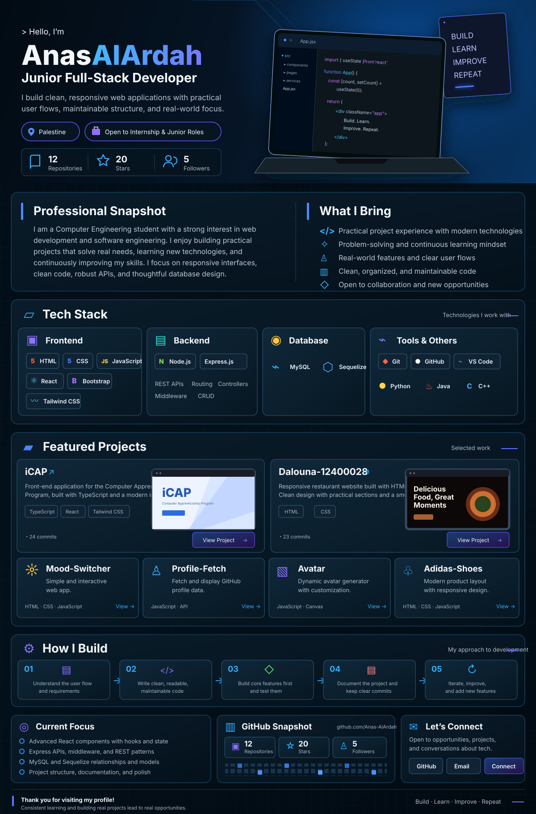

 

  

<a href="https://github.com/Anas-AlArdah/iCAP">iCAP</a>
&nbsp;·&nbsp;
<a href="https://github.com/Anas-AlArdah/Dalouna-12400028">Dalouna</a>
&nbsp;·&nbsp;
<a href="https://github.com/Anas-AlArdah/Mood-Switcher">Mood Switcher</a>
&nbsp;·&nbsp;
<a href="https://github.com/Anas-AlArdah/Profile-Fetch">Profile Fetch</a>
&nbsp;·&nbsp;
<a href="https://github.com/Anas-AlArdah/Avatar">Avatar</a>
&nbsp;·&nbsp;
<a href="https://github.com/Anas-AlArdah/Adidas-Shoes">Adidas Shoes</a>

