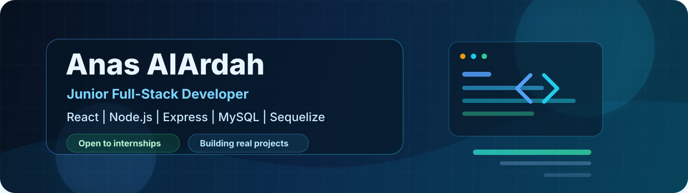

<div align="center">



<br/>

<a href="mailto:anas.alardah.ar@gmail.com">
  
</a>

<a href="https://github.com/Anas-AlArdah">
  
</a>


<br/><br/>


</div>

---

# 👨‍💻 Professional Snapshot

<table>
<tr>

<td width="58%" valign="top">

### About Me

I'm **Anas AlArdah**, a Computer Engineering student and Junior Full-Stack Developer focused on building practical, maintainable and real-world web applications.

I enjoy taking an idea from a simple concept to a working product — designing the interface, building backend APIs, structuring databases, handling authentication, and connecting everything into a complete system.

My goal is not just to make software that *works*, but software that is:

- Clean and maintainable
- Responsive and user-friendly
- Structured for future growth
- Built around real user flows
- Properly documented
- Continuously improved

</td>

<td width="42%" valign="top">

### ⚡ What I Bring

`</>` Practical full-stack development

`◉` Problem-solving mindset

`▣` Experience building real projects

`⚙` REST API development

`◆` Database design & integration

`✓` Clean project structure

`↗` Continuous learning

`∞` Open to collaboration

</td>

</tr>
</table>

---

# 🛠 Tech Stack

<table>
<tr>

<td width="25%" valign="top">

### 🎨 Frontend


<br/>

- HTML5
- CSS3
- JavaScript
- React
- React Router
- Responsive UI
- Material UI
- Bootstrap
- Tailwind CSS

</td>

<td width="25%" valign="top">

### ⚙ Backend


<br/>

- Node.js
- Express.js
- REST APIs
- Routing
- Controllers
- Middleware
- CRUD
- Authentication

</td>

<td width="25%" valign="top">

### 🗄 Database


<br/>

- PostgreSQL
- Supabase
- MySQL
- Sequelize
- Relationships
- Models
- Migrations

</td>

<td width="25%" valign="top">

### 🔧 Tools


<br/>

- Git
- GitHub
- VS Code
- Docker
- Postman
- Python
- Java
- C++

</td>

</tr>
</table>

---

# 🚀 Featured Project

<table>
<tr>

<td width="55%" valign="top">

## 🏗 Binaa Pal

### Local Services Marketplace for Palestine

**Binaa Pal** is a full-stack platform connecting clients with skilled local workers and tradespeople.

Instead of being an open bidding marketplace, the platform allows clients to directly discover and choose workers based on their needs.

### ✦ Main Features

- Search workers by **craft, location and name**
- View detailed worker profiles
- Worker portfolio management
- Worker availability
- Direct service requests
- Order lifecycle management
- Client reviews after completed work
- Client / Worker / Admin roles
- Admin dashboard
- Authentication system
- Responsive user interface

<br/>

### Technology


<br/><br/>

<a href="https://github.com/Anas-AlArdah/Binaa_Pal">

</a>

</td>

<td width="45%" valign="top">

### Architecture

```text
Binaa Pal
│
├── Client
│   ├── Search workers
│   ├── Worker profiles
│   ├── Service requests
│   └── Reviews
│
├── Worker
│   ├── Profile
│   ├── Portfolio
│   ├── Availability
│   └── Orders
│
├── Admin
│   └── Platform management
│
├── React Frontend
│
├── Node + Express API
│
└── Supabase PostgreSQL
